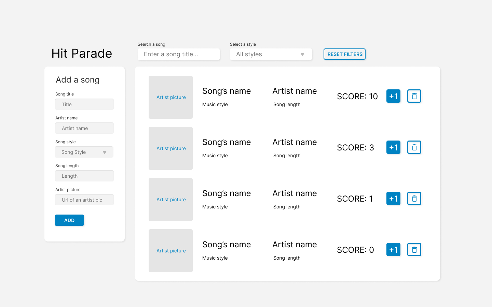

# WKP8

Hello team! Here's the weekend project 8.

We're going to build a hit parade.

-   That's a list of songs, sorted from the most popular to the least popular.
-   When we add a new song to the hit parade, the song score is set to zero.
-   The song list is always sorted from the highest score song to the lowest.
-   We can increment the score by clicking the +1 button.
-   We wan delete a song from the list by clicking the bin icon.
-   We can filter the list, by searching for a song title
-   We can filter the list, by selecting a song style in the select.
-   When we click the _reset filters_ button, the filter form is reset, and the list comes back to normal.
-   The data will be saved on the localstorage (except when you filter data)

### Tips :

-   Focus on the features first, and if you have some time left, try to replicate this design.
-   Start by choosing the song data structure, and create a few of them in the code.
-   Focus on your basic app functionality first, and then try to save the state of your app to _Local Storage_.

Also, please update this readme with the answer to those questions before submitting the project.

### Student report :

1. In a few sentences, explain the structure of your project.

2. If you had more time, what area of your project would you improve?

3. Did you learn anything new while working on this project?

4. What was the most challenging part for you?

5. Would you like a new explanation about a specific topic?

6. Any other comments?

Fork this project and then clone your fork to your computer.

I will download everybody's fork on **_Sunday at 5pm_**.

Good luck everyone! 🔥
